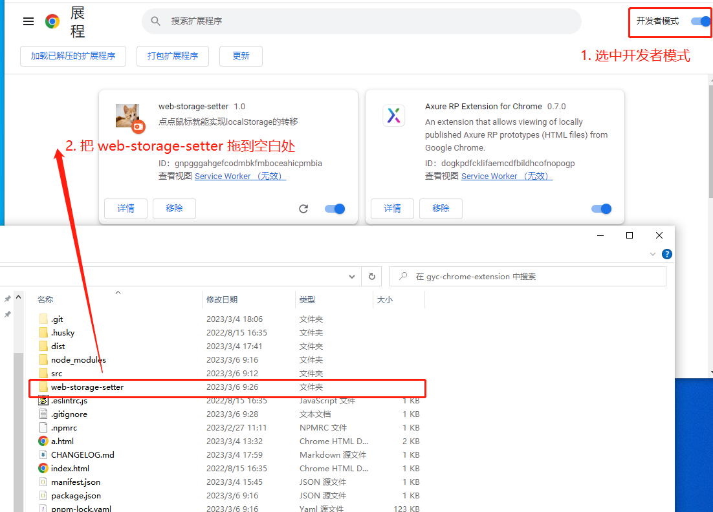
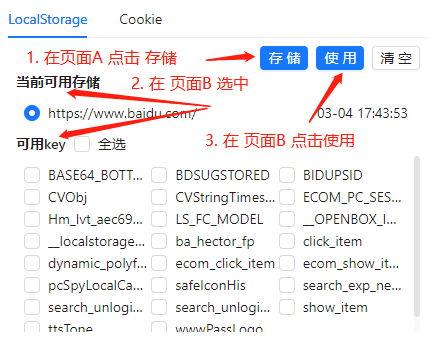

## web-storage-setter

支持在页签中转移 localStorage
适用于公司本地开发

> chrome extension V3 文档
>
> https://developer.chrome.com/docs/extensions/mv3/

### 安装

1. 打开 chrome://extensions/ 勾选上开发者模式
2. 拖入 web-storage-setter 文件夹即可



### 使用方式

页面 A 页面 B
我们要把 A 的 localStorage 转移到 B 中



### 如何更新？

进入仓库直接 git pull 即可

### 开发

1. pnpm i
2. pnpm run watch 并且把 dist 文件夹作为一个插件拖入 chrome 中

### 目录

```
├── README.md
├── dist // 打包后的文件夹
├── index.html // 主页
├── manifest.json // 插件配置
├── package.json
├── src
│   ├── App.tsx
│   ├── background.ts // background
│   ├── main.tsx
├── ├── contentScript.ts // content_scripts
│   └── vite-env.d.ts
├── tsconfig.json
├── vite.config.ts
└── pnpm-lock.yaml
```

### 添加一个 husky

1. npx husky install
2. npx husky add .husky/pre-commit "node_modules/.bin/lint-staged"
3. package.json 对应修改

### 注意

1. 使用 yarn 安装报命令找不到的情况

   参考 [https://classic.yarnpkg.com/en/docs/cli/global]('https://classic.yarnpkg.com/en/docs/cli/global')

2. 想要 sourceMap 的同学可以自行打开

### TODO

[] 支持用户自定义 默认选中值

[x] 使用 chrome.tabs.excuse 替换 content_scripts 做到不用重启浏览器也能使用

[] 切换选中时，全选按钮的状态显示问题，需要 重新计算 selectKey（存在 defaultKey 就选中）

[] 请求拦截、返回 mock 数据

[] 支持修改地址栏 通过 tag 形式加上参数
