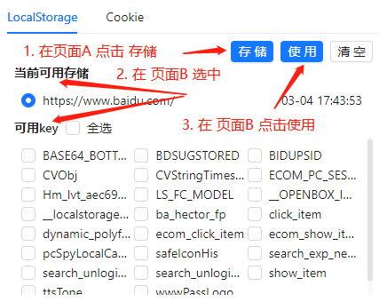

## web-storage-setter

支持再页签中转移 localStorage
适用于公司本地开发

### 使用方式

页面 A 页面 B
我们要把 A 的 localStorage 转移到 B 中



1. 在 页面 A 点击存储

此时插件会记录 页面 A 的信息

2. 切换到 页面 B 并且选择一个之前存储的 页面 LS 和 需要的 key

3. 在 页面 B 点击使用

插件会把之前记录的 A 的 LS 覆盖到 B 中

### 安装

1. pnpm i
2. pnpm run build 并且把 dist 文件夹作为一个插件拖入 chrome 中

### 开发 热更新

1. pnpm i
2. pnpm run watch 并且把 dist 文件夹作为一个插件拖入 chrome 中

### 目录

```
├── README.md
├── dist // 打包后的文件夹
├── index.html // 主页
├── manifest.json // 插件配置
├── package.json
├── src
│   ├── App.tsx
│   ├── background.ts // background
│   ├── main.tsx
├── ├── contentScript.ts // content_scripts
│   └── vite-env.d.ts
├── tsconfig.json
├── vite.config.ts
└── pnpm-lock.yaml
```

### 添加一个 husky

1. npx husky install
2. npx husky add .husky/pre-commit "node_modules/.bin/lint-staged"
3. package.json 对应修改

### 注意

1. 使用 yarn 安装报命令找不到的情况

   参考 [https://classic.yarnpkg.com/en/docs/cli/global]('https://classic.yarnpkg.com/en/docs/cli/global')

2. 想要 sourceMap 的同学可以自行打开

### TODO

[ ] 支持用户自定义 默认选中值
